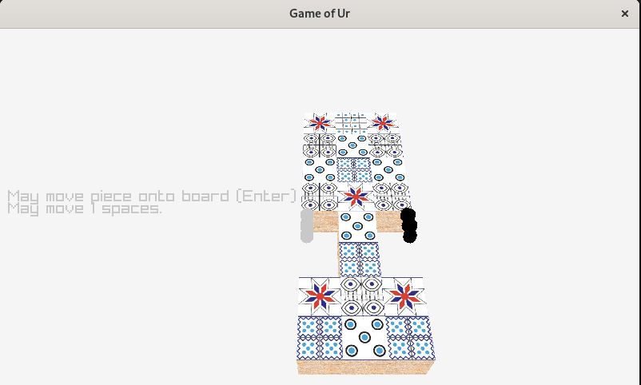

# Overview

I haven't made a full game in a long while, and had mostly done it in environments like Unity and Unreal, and wanted to try something like raylib, now
that I have a lot more experience in software and such.

And so, the main goal is to have a complete, non-trivial project, and not necessarily maintained over the long term.

I decided to implement *The Game of Ur*, generally considered the oldest board game we know the rules to (more or less).

This project uses C++, Raylib for the audiovisual engine (curses for a terminal frontend), and meson for the build system.

There are some rough-edges, in particular meson build files have an inconsistent style as I did not know meson when I first started this.
Eventually, I plan to go back to clean this part up, and others.

The project is pretty much "done" but various cleanup work could be done, but would be beyond the scope of the original intentions of the project.

# Rules
We use the rules from https://www.mastersofgames.com/rules/royal-ur-rules.htm, with the attached PDF for clarification :)

Note that what they call a "row" is what we in programming would traditionally call a column

What they call a "top row" is a coord of x=0, "lower row" being x=2 and so forth.

# Dependencies

* `meson`
* `cmake` for the raylib front end
* `curses` for the curses front end

# Building

This project uses git submodules! (for raylib). This should work on most desktop and web platforms but currently only been tested on Linux.

Once all dependencies are installed, a simple `meson setup build && cd build && ninja` should be sufficient to build the binaries

To set different options for the raylib front end, e.g. a custom window title, do:

`meson setup build -Draylibfe:WINDOW_TITLE="Custom title" && cd build && ninja`

# Structure

This project is structured as a series of submodules, some with dependencies on others.

## External subprojects

There are 2 external modules included in this project; `gtest` and `raylib`, the former uses 
a meson wrapdb file, and the latter is included as a cmake subproject, using meson's functionality to include a cmake project as a sub project.
The former is used for testing the `libur` project, and the latter to provide audiovisual and interactive functionality for the `raylibfe` front end.

## `libur` subproject

This is the backend, the rules engine implementing the Game of Ur. It is modularized away from the front-end and so can be easily used as part
of another project.

## `cursesfe` subproject

This was the first frontend created, this is mostly intended for debugging and development purposes and so isn't terribly pretty. But,
it gets the job done for something easy to get running to get a visual look at game state, and to interact with it.

## `raylibfe` subproject

The actual "Game" part of it. The 3D graphical frontend that is primarily focused on. It's not the prettiest.

## `ai` subproject

A class structure allowing for different types of AI's. 2 are implemented; "Random AI" which simply makes random moves, and "Oracle AI" which
is a classical AI implementing the alpha-beta pruning algoreithm.

# Credits

The tile textures were pulled from the PDF in this project. The board model was created by me (Keith Stellyes) in Blender. 
The board texture was created by Joseph Francis and downloaded from Wikimedia Commons: https://commons.wikimedia.org/wiki/File:Balsa_Wood_Texture.jpg

See individual source files that use various online examples